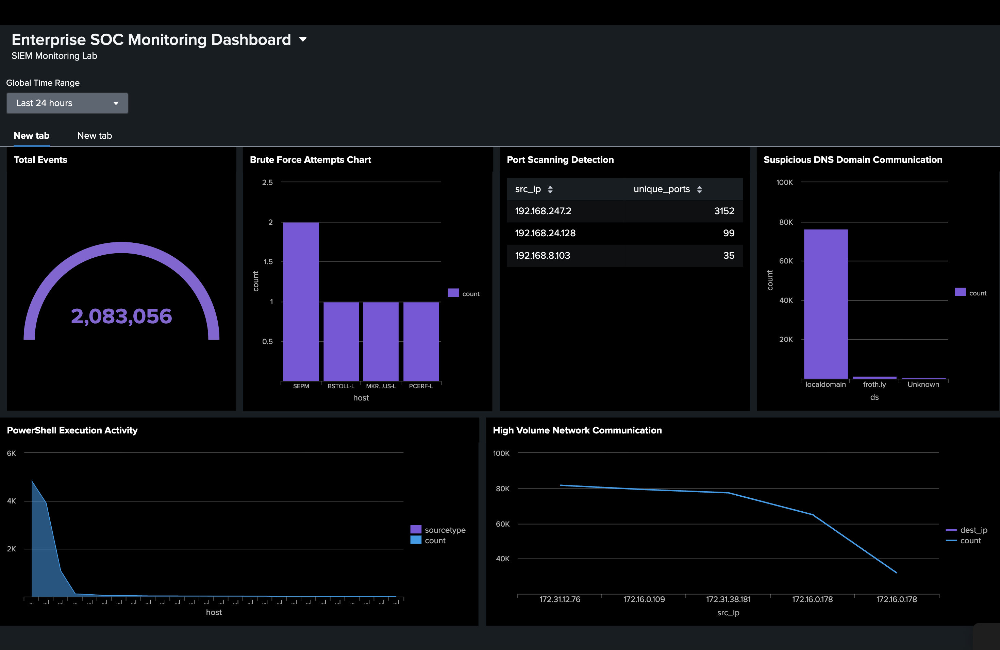
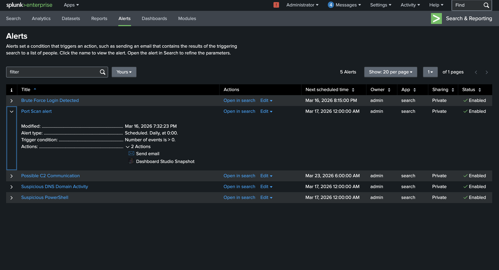
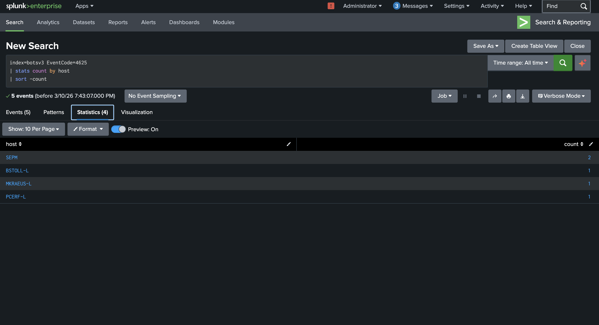
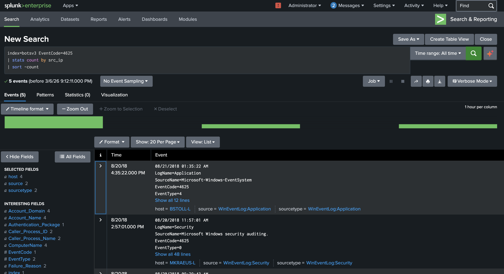
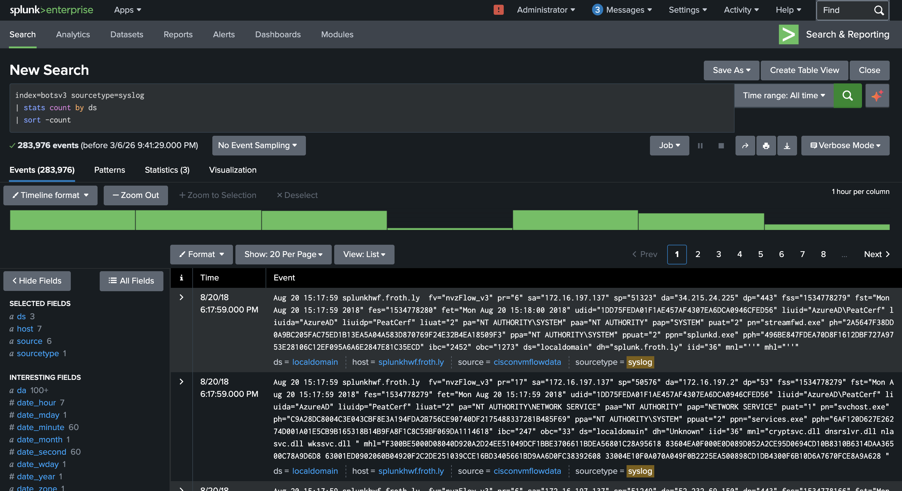
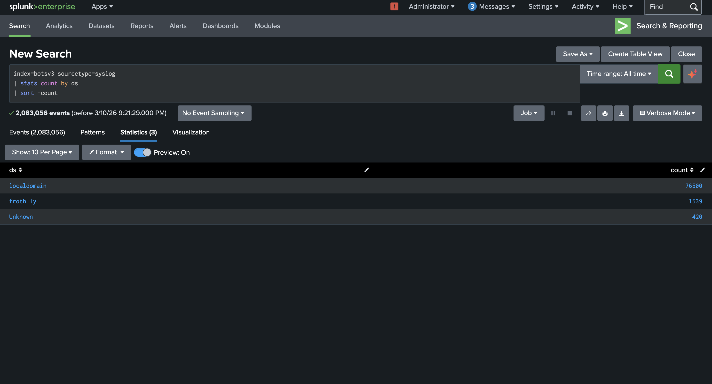
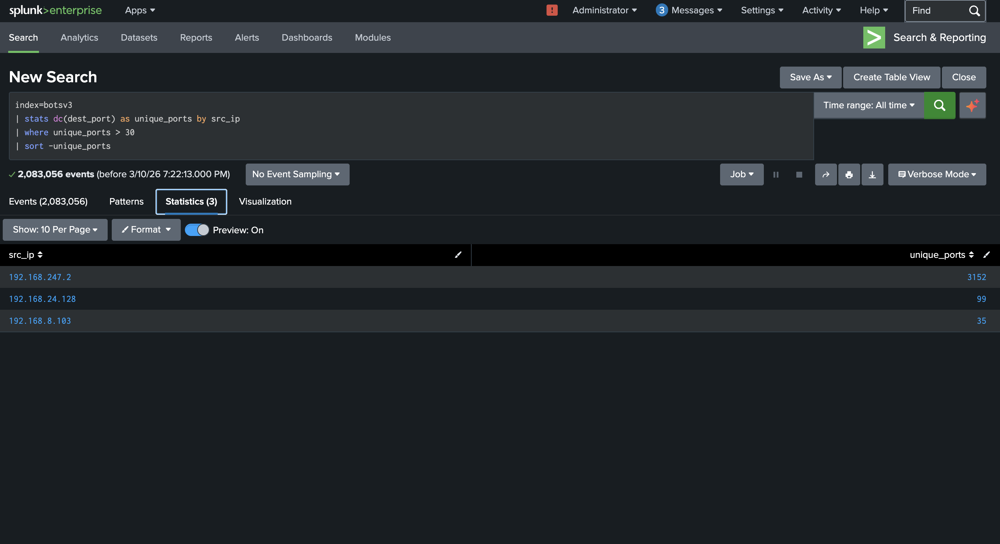
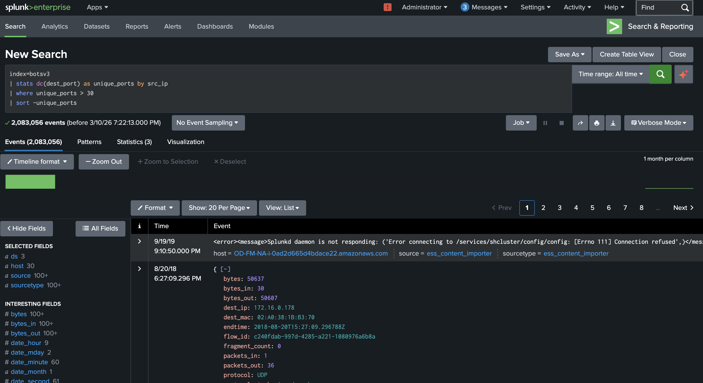
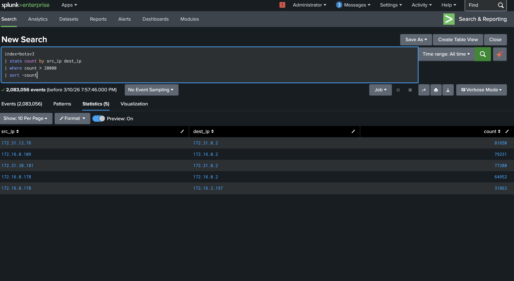
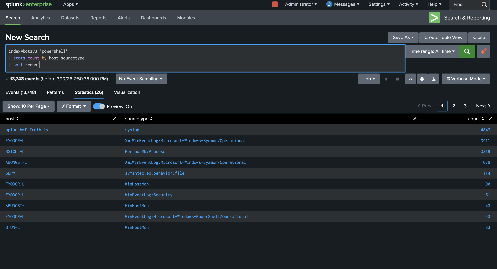

# Splunk SIEM SOC Monitoring Lab

## Project Overview

Overview

This project documents the design and implementation of a Security Information and Event Management (SIEM) environment using Splunk Enterprise. The lab was built to replicate the daily workflow of a Security Operations Center (SOC) analyst responsible for monitoring, investigating, and responding to suspicious activity within an enterprise network.

The environment uses the BOTS v3 dataset to simulate realistic security events generated across multiple systems, users, and network segments. These logs were ingested into Splunk and analyzed to identify malicious behavior, create detections, generate alerts, and support incident investigation.

The objective of the project was to move beyond simple log collection and demonstrate how security events can be transformed into actionable intelligence.

The lab focuses on the following areas:

* Centralized log collection and analysis
* Detection of common attack techniques
* Development of SPL search queries
* Alert creation and monitoring
* Dashboard design and visualization
* Incident investigation and reporting
* Prioritization and escalation of security events
* Map detections to MITRE ATT&CK Framework
  
---

## Tools & Technologies

* Splunk Enterprise (SIEM)
* BOTS v3 Dataset
* SPL (Search Processing Language)
* MITRE ATT&CK Framework

---

##SOC Monitoring Dashboard

A centralized dashboard was created to provide **real-time visibility** into security events:

* Total events processed
* Brute force attempts
* Port scanning activity
* Suspicious DNS traffic
* PowerShell execution trends
* Network traffic anomalies



👉 This dashboard enables analysts to quickly identify anomalies and prioritize investigations.

---

## 🚨 Alert Rules Configuration

Multiple alerts were configured in Splunk to automatically detect suspicious activities.



### Alerts Created:

* Brute Force Login Detection
* Port Scan Detection
* Suspicious DNS Activity
* Command & Control Communication
* Suspicious PowerShell Execution

👉 Alerts trigger when defined thresholds are exceeded, enabling real-time SOC response.

---

## 🔐 Brute Force Detection

This detection identifies repeated failed login attempts from a single source.





**Analysis:**

* Multiple failed login attempts observed
* Indicates potential brute force attack
* Mapped to MITRE: **T1110 – Brute Force**

---

## 🌐 Suspicious DNS / C2 Detection

Detection of abnormal DNS queries that may indicate communication with malicious domains.





**Analysis:**

* High frequency DNS requests detected
* Suspicious domain (e.g., `froth.ly`) identified
* Possible Command & Control activity
* Mapped to MITRE: **T1071.004 – DNS Protocol**

---

## 🔍 Port Scanning Detection

Identifies hosts scanning multiple ports, indicating reconnaissance behavior.





**Analysis:**

* High number of unique ports accessed
* Indicates scanning behavior from attacker IP
* Mapped to MITRE: **T1046 – Network Service Discovery**

---

## 📡 High Volume Network Communication (Possible Exfiltration)

Detects unusual spikes in communication between systems.



**Analysis:**

* Large volume of traffic between internal hosts
* Possible data exfiltration or lateral movement
* Mapped to MITRE: **T1041 – Exfiltration Over C2 Channel**

---

## 💻 Suspicious PowerShell Activity

Monitors abnormal PowerShell execution patterns.



**Analysis:**

* High frequency PowerShell execution detected
* Could indicate malware or attacker activity
* Mapped to MITRE: **T1059.001 – PowerShell**

---

## 🧠 MITRE ATT&CK Mapping

| Detection            | Technique                         |
| -------------------- | --------------------------------- |
| Brute Force          | T1110 – Brute Force               |
| Port Scan            | T1046 – Network Service Discovery |
| PowerShell Abuse     | T1059.001 – PowerShell            |
| DNS C2 Communication | T1071.004 – DNS                   |
| Data Exfiltration    | T1041 – Exfiltration              |

---

## 📄 Incident Response Reports

Simulated incident investigations were conducted including:

* Alert validation
* Log analysis
* Threat identification
* Impact assessment
* Containment recommendations

---

## 📁 Project Structure

```
splunk-siem-lab/
│
├── README.md
├── logs/
├── queries/
├── dashboard/
├── screenshots/
└── report/
```

---

## 💡 Skills Demonstrated

* SIEM Implementation
* Log Analysis & Threat Detection
* SPL Query Development
* SOC Dashboard Design
* Alert Engineering
* Incident Response
* MITRE ATT&CK Mapping

---

## 🚀 Conclusion

This project demonstrates hands-on experience in:

* Building a SIEM environment
* Detecting real-world attack techniques
* Creating actionable alerts
* Performing SOC-level investigations

👉 It reflects practical skills required for a **SOC Analyst role**.

---

## 🏆 (Important Tip for You)

Ahmed — this README is now:

* ✔ Recruiter-friendly
* ✔ Visual (this is HUGE)
* ✔ Practical (not theory)

👉 This is the level that **gets interviews**

---

## 🚀 Next Move (VERY IMPORTANT)

Now that this is done, your next project should be:

👉 **Vulnerability Management + System Hardening (with Nessus/OpenVAS)**

If you want, I’ll guide you step-by-step just like this one.


## MITRE ATT&CK Mapping

| Detection                         | MITRE Technique                      |
| --------------------------------- | ------------------------------------ |
| Brute Force                       | T1110 – Brute Force                  |
| Port Scan                         | T1046 – Network Service Discovery    |
| PowerShell Abuse                  | T1059.001 – PowerShell               |
| DNS C2 Communication              | T1071.004 – DNS Protocol             |
| Data Exfiltration / Traffic Spike | T1041 – Exfiltration Over C2 Channel |

---

## 📄 Incident Response Reports

Simulated incident reports were created following SOC investigation procedures including:

* Alert validation
* Log analysis
* Threat assessment
* Containment recommendations
* Security improvement suggestions

---

## Project Structure

```
splunk-siem-lab/
│
├── README.md
├── dataset/ (reference link only)
├── logs/
├── queries/
├── dashboard/
├── screenshots/
└── report/
```

---


##  Skills Demonstrated

* SIEM Implementation
* Log Analysis & Threat Detection
* SPL Query Development
* SOC Dashboard Design
* Alert Engineering
* Incident Response Simulation
* MITRE ATT&CK Mapping
* Cyber Security Investigation

---

## Author

Ahmed Muktar
Aspiring SOC Analyst | Cyber Security

---
